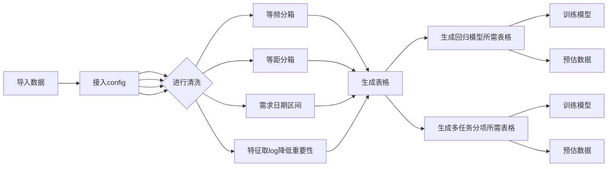
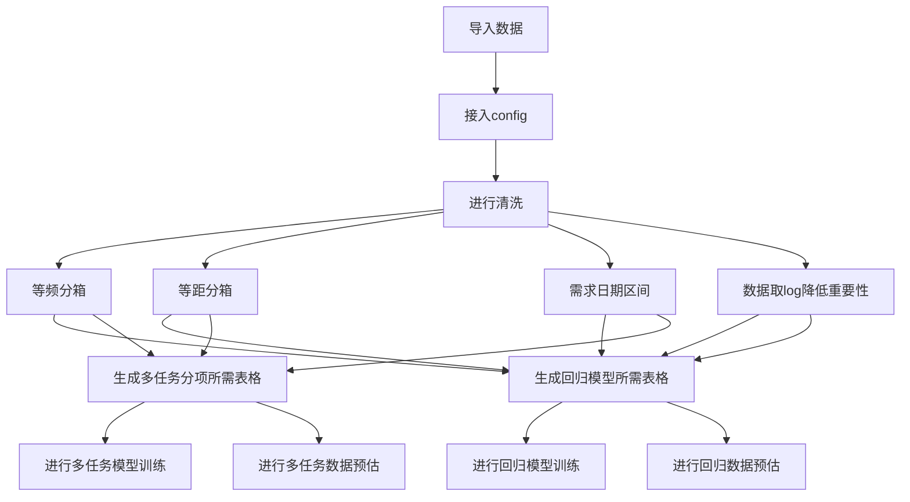

# 营建分析1.0

## 通过数据清洗和特征工程筛选出所需数据后，对已有数据进行模样预测并将数据打包

# 文件

-config
-main

## Config

加载重要特征和所需要处理的特征至配置文件。
## main
 流程图：

All your files and folders are presented as a tree in the file explorer. You can switch from one to another by clicking a file in the tree.

##  clean class
创造一个数据清洗的类 里面包含等频分箱、等距分箱、需求日期区间和清洗数据的功能。使加载进来的数据能更好的被利用。为结果产生更高额精准性。
- pct_rank_qcut
等频分箱所用函数
-  dis_box
等距分箱所用函数
-  reqiure_date
需求日期区间所用函数
-  clean_train_table
清洗训练数据所用函数
-  clean_predict_table
清洗预测数据所用函数
	>案例
	清洗df的数据并加载所需要的参数
	**clean(df,config)**

## train
使用train函数为模型进行训练并生成所需模型
步骤流程
 1. 导入数据并进行清理和特征工程
 2. 为模型选取需要的内容并进行重命名
 3. 为模型将原始数据按照比例分割为“测试集”和“训练集”
 4. 为Lightgbm设置参数
 5. 进行训练
 6. 返回结果
> 案例
以有效工期为目标训练df的数据。
 **train(df,config,'有效工期')**

## data_predict
使用data_predict函数为模型进行预估并输出结果。
步骤流程
 1. 导入数据并进行清理和特征工程
 2. 为模型选取需要的内容并进行重命名
 3. 预测模型
 4. 将预测结果打包
 5. 返回结果
> 案例
用result的模型为df的数据进行需求预估。
 **data_predict(result,df,config)**
